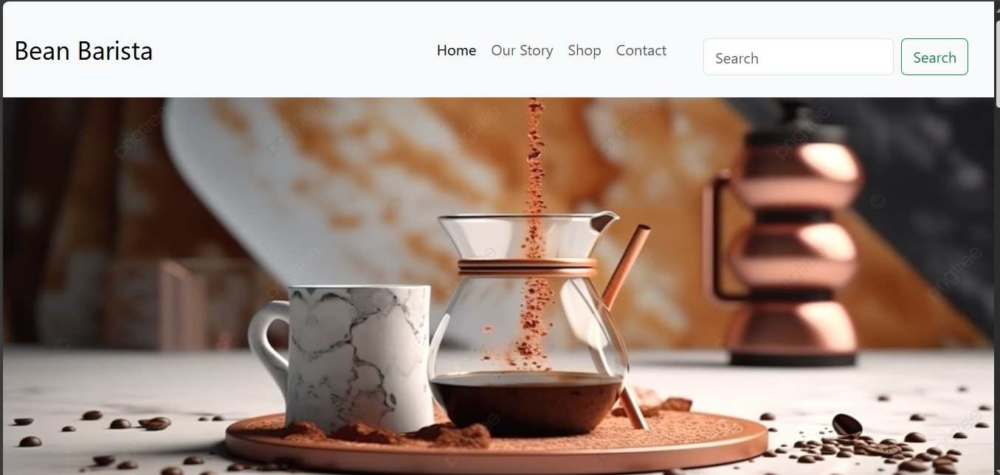
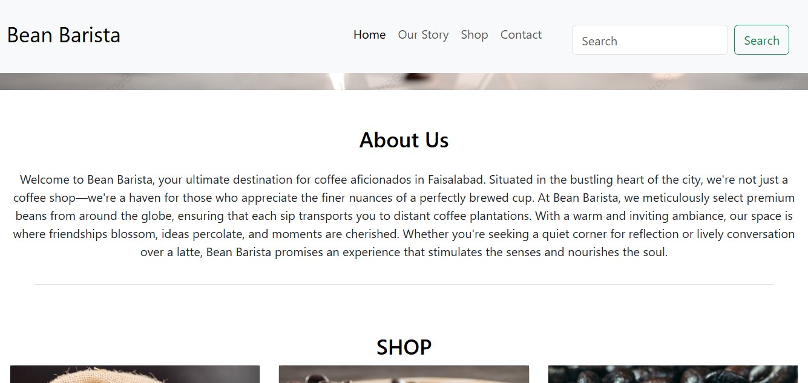
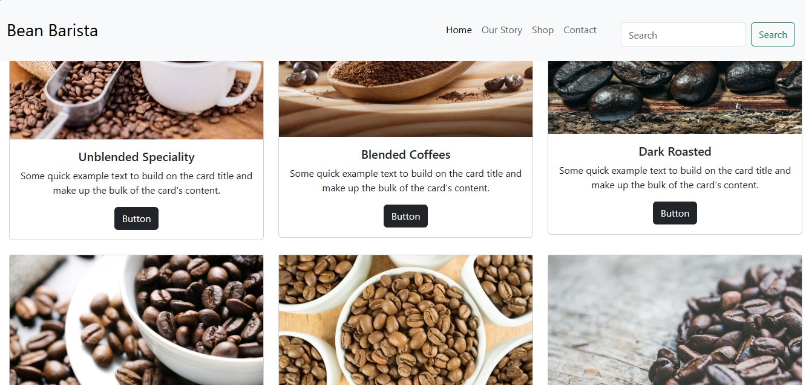
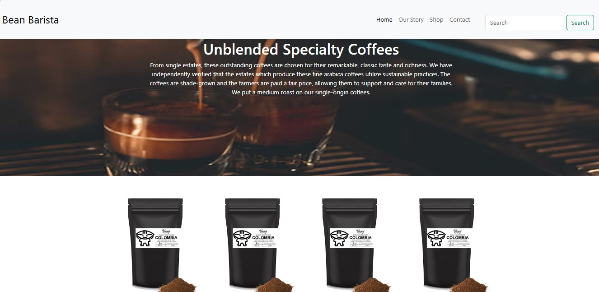
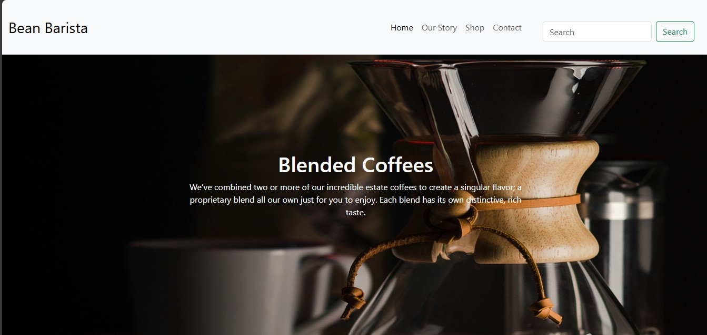
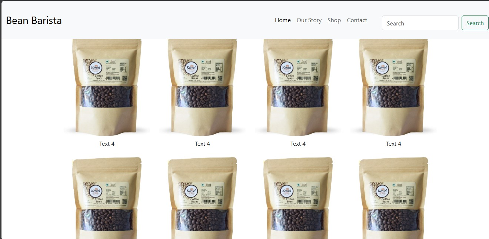
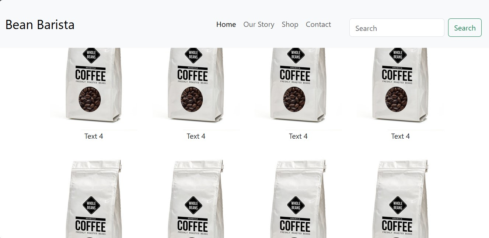
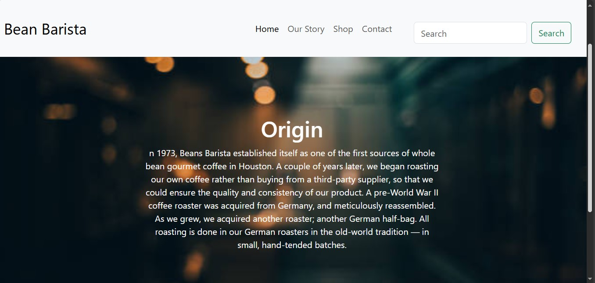
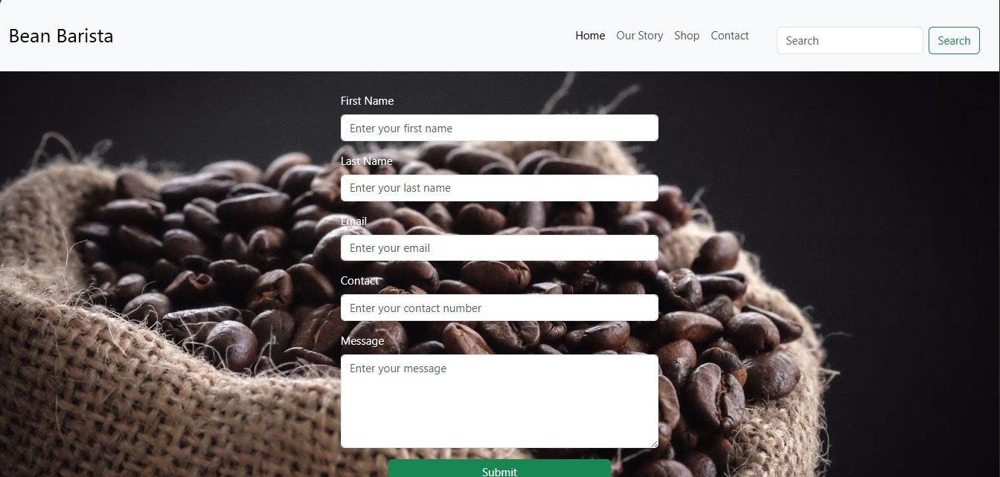

# ☕ Bean Barista – Coffee House Website  

A responsive **coffee house website** designed to showcase products, share the café's story, and allow customers to explore available coffee blends and connect with the business.  

Built using **HTML5**, **CSS3**, and **Bootstrap 5** for a modern, mobile-friendly layout.  

---

## 🚀 Features  

- 📌 **Responsive Navbar** – Collapsible off-canvas navigation for mobile users.  
- 🖼️ **Hero Section** – Full-width banner image to set the mood.  
- 📝 **About Us Section** – Highlights the café’s story and values.  
- 🛍️ **Shop Section** – Product cards for different coffee blends categories with links to detail pages.
- 📨 **Contact Form** – Easy-to-use form for users to get in touch.  
- 📍 **Footer with Location & Hours** – Displays contact info and opening hours.  

---

## 🛠️ Tech Stack  

- **HTML5** – Structure and semantic layout  
- **CSS3** – Custom styling  
- **Bootstrap 5** – Responsive grid, navbar, and cards  

---
## 📸 Screenshots  

### 🏠 Homepage  
<p align="center">
  
  
  
  
</p>

### 🛍️ Shop Section  
<p align="center">
  
  
  
  
  
</p>

### 📖 Our Story  
<p align="center">
  
</p>

### 📞 Contact  
<p align="center">
  
</p>


---

## 📌 How to Run  

1. Clone this repository:  
   ```bash
   git clone https://github.com/yourusername/coffee-house-website.git
   
Open index.html in your browser.

No additional setup is required — it's a static website.

